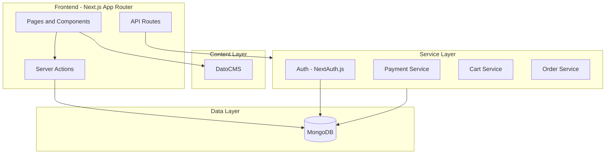

# Cats Den - Kitten Ecommerce Store

## Architecture Overview



## Tech Stack

| Layer | Technology |
|-------|------------|
| Framework | Next.js 14 (App Router) |
| Styling | Tailwind CSS + custom theme |
| CMS | DatoCMS (GraphQL API) |
| Database | MongoDB with Mongoose |
| Auth | NextAuth.js v5 |
| Payments | Abstract layer (Stripe-ready) |
| State | Zustand (cart state) |
| Forms | React Hook Form + Zod |

## Design Theme

A warm, playful yet premium aesthetic:

- **Typography**: "Outfit" for headings (friendly, modern), "DM Sans" for body
- **Color Palette**: Warm cream backgrounds (#FDF8F3), terracotta accents (#E07A5F), deep charcoal text (#2D3436), soft coral highlights (#F8B4A9)
- **Visual Elements**: Soft rounded corners, subtle paw-print patterns, floating card animations, warm gradient overlays on hero sections
- **Photography**: Large, high-quality kitten imagery with soft shadows

## Project Structure

```
cats_den/
├── app/
│   ├── (shop)/                 # Public shop routes
│   │   ├── page.tsx            # Homepage
│   │   ├── kittens/            # Kitten catalog
│   │   ├── kitten/[slug]/      # Kitten detail
│   │   ├── breeds/             # Browse by breed
│   │   ├── cart/               # Shopping cart
│   │   └── checkout/           # Checkout flow
│   ├── (content)/              # CMS-driven pages
│   │   ├── about/
│   │   ├── blog/
│   │   ├── shipping/
│   │   └── health-guarantee/
│   ├── (auth)/                 # Auth pages
│   │   ├── login/
│   │   ├── register/
│   │   └── account/            # User dashboard
│   ├── api/                    # API routes
│   │   ├── auth/
│   │   ├── cart/
│   │   ├── orders/
│   │   └── webhooks/
│   └── layout.tsx
├── components/
│   ├── ui/                     # Base UI components
│   ├── shop/                   # Shop-specific components
│   ├── layout/                 # Header, Footer, Nav
│   └── forms/                  # Form components
├── lib/
│   ├── dato/                   # DatoCMS client & queries
│   ├── db/                     # MongoDB connection & models
│   ├── auth/                   # NextAuth config
│   ├── payments/               # Payment abstraction
│   └── utils/                  # Helpers
├── stores/                     # Zustand stores
└── types/                      # TypeScript types
```

## Data Architecture

### DatoCMS Models (Content)

- **Kitten**: name, slug, breed, price, age, gender, description, images, availability, featured
- **Breed**: name, slug, description, image, characteristics
- **Page**: title, slug, content (structured text)
- **BlogPost**: title, slug, excerpt, content, author, publishedAt
- **Testimonial**: customerName, quote, rating, kittenPurchased

### MongoDB Collections (Transactional)

- **users**: id, email, passwordHash, name, addresses, createdAt
- **orders**: id, userId, items, status, total, shippingAddress, paymentStatus
- **carts**: id, sessionId/userId, items, updatedAt

## Core Features

### Phase 1: Foundation

- Next.js project setup with TypeScript and Tailwind
- DatoCMS integration with GraphQL client
- MongoDB connection with Mongoose models
- Base UI component library
- Responsive layout (Header, Footer, Navigation)

### Phase 2: Catalog

- Homepage with hero, featured kittens, breed showcase
- Kitten listing page with filters (breed, gender, age, price)
- Kitten detail page with image gallery, specifications
- Breed pages with related kittens
- Search functionality

### Phase 3: Ecommerce

- Shopping cart (Zustand + API persistence)
- User authentication (NextAuth.js)
- User account dashboard (profile, orders, wishlist)
- Checkout flow with address management
- Order creation and confirmation

### Phase 4: Content

- Blog with DatoCMS structured text
- Static pages (About, Shipping, Health Guarantee)
- Testimonials section
- Contact form with inquiry types

### Phase 5: Payments (Infrastructure)

- Abstract payment service interface
- Order status management
- Email notifications (order confirmation)
- Webhook handlers ready for payment providers

## Key Files

| File | Purpose |
|------|---------|
| `lib/dato/client.ts` | DatoCMS GraphQL client setup |
| `lib/dato/queries.ts` | All CMS queries |
| `lib/db/connection.ts` | MongoDB connection singleton |
| `lib/db/models/` | Mongoose schemas (User, Order, Cart) |
| `lib/auth/config.ts` | NextAuth.js configuration |
| `lib/payments/service.ts` | Abstract payment interface |
| `stores/cart.ts` | Zustand cart store |
| `components/ui/` | Button, Card, Input, Modal, etc. |

## Environment Variables Required

```env
# DatoCMS
DATOCMS_API_TOKEN=           # Read-only API token from DatoCMS
DATOCMS_PREVIEW_SECRET=      # Secret for preview mode URL validation
DATOCMS_WEBHOOK_SECRET=      # Secret for webhook authentication

# MongoDB
MONGODB_URI=

# NextAuth
NEXTAUTH_SECRET=
NEXTAUTH_URL=

# Payment (future)
PAYMENT_PROVIDER=
PAYMENT_SECRET_KEY=
PAYMENT_PUBLIC_KEY=
```

## DatoCMS Setup

### Preview Mode Configuration
In DatoCMS, go to Settings → Build triggers → Preview URL and add:
```
https://your-domain.com/api/preview?secret=YOUR_PREVIEW_SECRET&slug={slug}&model={model}
```

### Webhook Configuration
In DatoCMS, go to Settings → Webhooks → Add new webhook:
- URL: `https://your-domain.com/api/webhooks/datocms`
- Headers: `x-webhook-secret: YOUR_WEBHOOK_SECRET`
- Triggers: Select all content model events (create/update/delete/publish)

## Getting Started

1. Install dependencies:
   ```bash
   npm install
   ```

2. Set up environment variables in `.env.local`

3. Run the development server:
   ```bash
   npm run dev
   ```

4. Open http://localhost:3000

The app includes mock data, so it works without DatoCMS configured.


